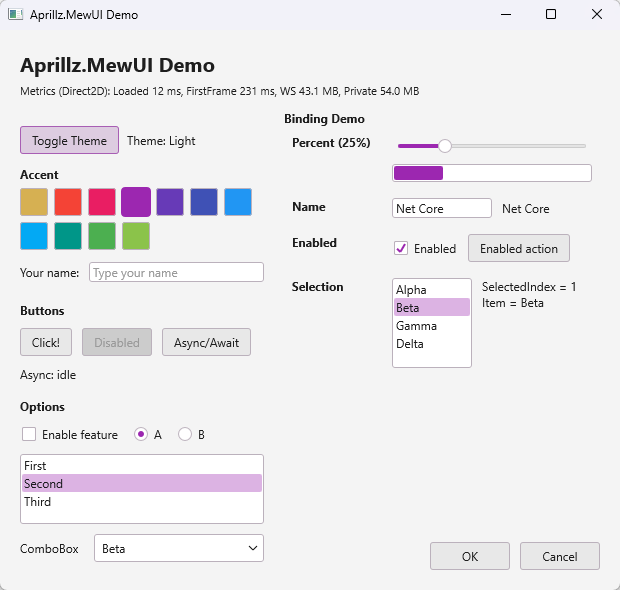
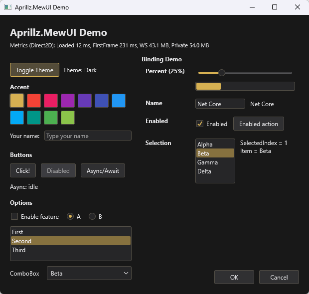

---

**😺 MewUI** is minimal, code-first .NET GUI library aimed at **NativeAOT + Trim**.

- **Status:** 🧪 experimental prototype (APIs and behavior may change).

- **Note:** 🤖 most of the code in this repository is written with the help of GPT.
---

## Screenshots

| Light | Dark |
|---|---|
|  |  |

---
## ✨ Highlights

- 📦 **NativeAOT + trimming** first
- 🪶 **Lightweight** by design (small EXE, low memory footprint, fast first frame — see benchmark below)
- 🧩 Fluent **C# markup** (no XAML)

---
## 🪶 Lightweight

- **Executable size:** NativeAOT + Trim focused (sample `win-x64-trimmed` is ~ `2.2 MB`)
- **Sample runtime benchmark** (NativeAOT + Trimmed, 50 launches):

| Backend | Loaded avg/p95 (ms) | FirstFrame avg/p95 (ms) | WS avg/p95 (MB) | PS avg/p95 (MB) |
|---|---:|---:|---:|---:|
| Direct2D | 10 / 11 | 178 / 190 | 40.0 / 40.1 | 54.8 / 55.8 |
| GDI | 15 / 21 | 54 / 67 | 15.2 / 15.3 | 4.6 / 4.8 |

---
## 🧪 C# Markup at a Glance

```csharp
var window = new Window()
    .Title("Hello MewUI")
    .Size(520, 360)
    .Padding(12)
    .Content(
        new StackPanel()
            .Spacing(8)
            .Children(
                new Label()
                    .Text("Hello, Aprillz.MewUI")
                    .FontSize(18)
                    .Bold(),
                new Button()
                    .Content("Quit")
                    .OnClick(() => Application.Quit())
            )
    );

Application.Run(window);
```

---
## 🎯 Concept

### MewUI is a code-first UI library with three priorities:
- **NativeAOT + trimming friendliness** (interop via `LibraryImport`)
- **Fluent C# markup** for building UI trees (no XAML)
- **AOT-friendly binding** (`ObservableValue<T>`, delegate-based, avoid reflection)

### Non-goals (by design):
- WPF-style **animations**, **visual effects**, or heavy composition pipelines
- A large, “kitchen-sink” control catalog (keep the surface area small and predictable)
- Full XAML/WPF compatibility or designer-first workflows

---
## ✂️ NativeAOT / Trim

- The library aims to be trimming-safe by default (explicit code paths, no reflection-based binding).
- Windows interop uses source-generated P/Invoke (`LibraryImport`) for NativeAOT compatibility.
- If you introduce new interop or dynamic features, verify with the trimmed publish profile above.

To check output size locally:
- Publish: `dotnet publish .\samples\MewUI.Sample\MewUI.Sample.csproj -c Release -p:PublishProfile=win-x64-trimmed`
- Inspect: `.artifacts\publish\MewUI.Sample\win-x64-trimmed\`

Reference (sample, `win-x64-trimmed`):
- `Aprillz.MewUI Demo.exe` ~ `2,257 KB`

---
## 🔗 State & Binding (AOT-friendly)

Bindings are explicit and delegate-based (no reflection):

```csharp
using Aprillz.MewUI.Binding;
using Aprillz.MewUI.Controls;

var percent = new ObservableValue<double>(
    initialValue: 0.25,
    coerce: v => Math.Clamp(v, 0, 1));

var slider = new Slider().BindValue(percent);
var label  = new Label().BindText(percent, v => $"Percent ({v:P0})");
```

- Tips
  - ✅ `Converter`: bind derived values without extra state
    ```csharp
    var label = new Label().BindText(percent, v => $"Percent ({v:P0})");
    ```
  - 🧲 `Coerce`: clamp/normalize values at the source
    ```csharp
    var percent = new ObservableValue<double>(0.25, coerce: v => Math.Clamp(v, 0, 1));
    ```

---
## 🧱 Controls / Panels

Controls:
- `Label`, `Button`, `TextBox`
- `CheckBox`, `RadioButton`
- `ListBox`, `ComboBox`
- `Slider`, `ProgressBar`
- `Window`

Panels:
- `Grid` (rows/columns with `Auto`, `*`, pixel)
- `StackPanel` (horizontal/vertical + spacing)
- `DockPanel` (dock edges + last-child fill)
- `UniformGrid` (equal cells)
- `WrapPanel` (wrap + item size + spacing)
---
## 🎨 Theme

Theme is split into two parts:
- `Palette` - colors (including derived colors based on background + accent)
- `Theme` - non-color parameters (corner radius, default font, plus a `Palette`)

Accent switching:

```csharp
Theme.Current = Theme.Current.WithAccent(Color.FromRgb(214, 176, 82));
```

---
## 🖌️ Rendering Backends

Rendering is abstracted through:
- `IGraphicsFactory` / `IGraphicsContext`

The sample defaults to `Direct2D`, with a `GDI` backend also available.

---
## 🪟 Platform Abstraction

Windowing and the message loop are abstracted behind a platform layer. The current implementation is Windows-only (`Win32PlatformHost`), with the intent to add Linux/macOS backends later.

---
## 🧭 Roadmap (TODO)

**Controls**
- [ ] `Image`
- [ ] `GroupBox`
- [ ] `TabControl`
- [ ] `ScrollViewer`

**Rendering**
- [ ] OpenGL backend

**Platforms**
- [ ] Linux
- [ ] macOS

**Tooling**
- [ ] Hot Reload 
- [ ] Design-time preview
